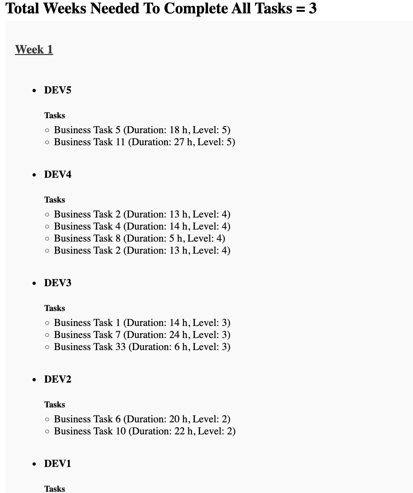
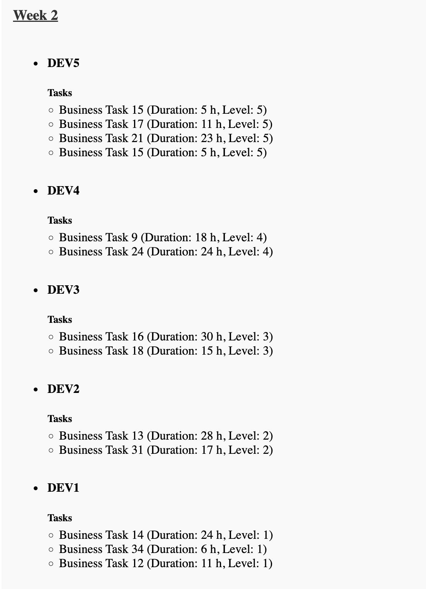

# Laravel Task Dağıtım ve Planlama Projesi

Bu proje, developer'lara iş dağıtımı yapan ve haftalık iş planlaması oluşturan bir Laravel uygulamasıdır. Uygulama, developer'ların haftalık çalışma kapasiteleri göz önüne alınarak görevlerin dağıtılmasını sağlar ve tüm işlerin ne kadar sürede tamamlanacağını hesaplar.

## Kurulum

### 1. Depoyu Klonlayın

Proje dosyalarını yerel makinenize klonlayın:

```bash
git clone <repo-url>
cd proje-ismi
```

### 2. Bağımlılıkları Yükleyin

#### Composer ile PHP bağımlılıklarını yükleyin:

```bash
composer install
```

#### NPM ile JavaScript bağımlılıklarını yükleyin:

```bash
npm install
```

### 3. Ortam Dosyasını Ayarlayın

`.env` dosyasını oluşturun ve yapılandırın:

```bash
cp .env.example .env
```

`.env` dosyasını düzenleyin ve veritabanı bilgilerinizi güncelleyin.

### 4. Uygulama Anahtarını Oluşturun

Laravel uygulaması için bir uygulama anahtarı oluşturun:

```bash
php artisan key:generate
```

### 5. Veritabanı Migrasyonlarını Çalıştırın

Veritabanı tablolarını oluşturmak için aşağıdaki komutu çalıştırın:

```bash
php artisan migrate
```

### 6. Dummy (sahte) Veriler Ekleyin (Opsiyonel)

Test verilerini oluşturmak için (Developer bilgileri) `seeder` kullanabilirsiniz:

```bash
php artisan db:seed
```

### 7. Uygulamayı Çalıştırın

Proje Laravel Valet kullanıyorsa:

```bash
valet link
```
ile uygulamayı bağlayıp  `http://<proje-ismi>.test ` bağlantısıyla tarayıcınızda projeyi çalıştırabilirsiniz. 

Valet kullanmıyorsanız, aşağıdaki komut ile projeyi başlatabilirsiniz:

```bash
php artisan serve
```

Proje localhost üzerinde 8000 portunda çalışacaktır. Tarayıcınızda `http://localhost:8000` adresine giderek uygulamayı görüntüleyebilirsiniz.

### 8. Vue.js ile Arayüzü Oluşturun

Frontend kısmını derlemek için aşağıdaki komutu çalıştırın:

```bash
npm run dev
```

Veya üretim ortamı için:

```bash
npm run prod
```

## Kullanım

- Görevler `TaskPlanningService` servisi aracılığıyla developer'lara dağıtılır.
- Arayüzde tüm görevler ve developer bazında iş planlaması haftalık olarak gösterilir.
- Her developer'ın üzerinde bulunan görevlerin toplam süresi ve kaç hafta süreceği hesaplanır.
  
### Komutlar

- Task'ları provider api'lerden çekip veritabanına insert etmek için özel bir `Artisan` komutu mevcuttur. Provider Api argümanı {provider?} opsiyoneldir, api ismi verilmediği takdirde tüm provider'lar için çalışacaktır:
  
```bash
php artisan app:fetch-tasks {provider?}
```

Bu komut ile tüm görevler, developer'ların kapasitesine göre dağıtılacaktır.

## Proje Yapısı

- **`app/Services/TaskPlanningService.php`**: Görev dağıtım ve planlama iş mantığını içerir.
- **`app/Http/Controllers/TaskController.php`**: Görev dağıtımını başlatmak için kullanılan kontrolcü.
- **`resources/views/`**: Blade dosyaları, yani sunum (UI) katmanı.
- **`resources/js/components/TaskPlanning.vue`**: Vue.js ile yazılmış frontend bileşeni.

## Geliştirme Ortamı Gereksinimleri

- PHP 8.0+
- Composer
- Node.js & NPM
- MySQL veya PostgreSQL
- Laravel 11.x
- Vue.js 3.x

## Lisans

Bu proje MIT lisansı altında lisanslanmıştır. Daha fazla bilgi için `LICENSE` dosyasına bakabilirsiniz.


